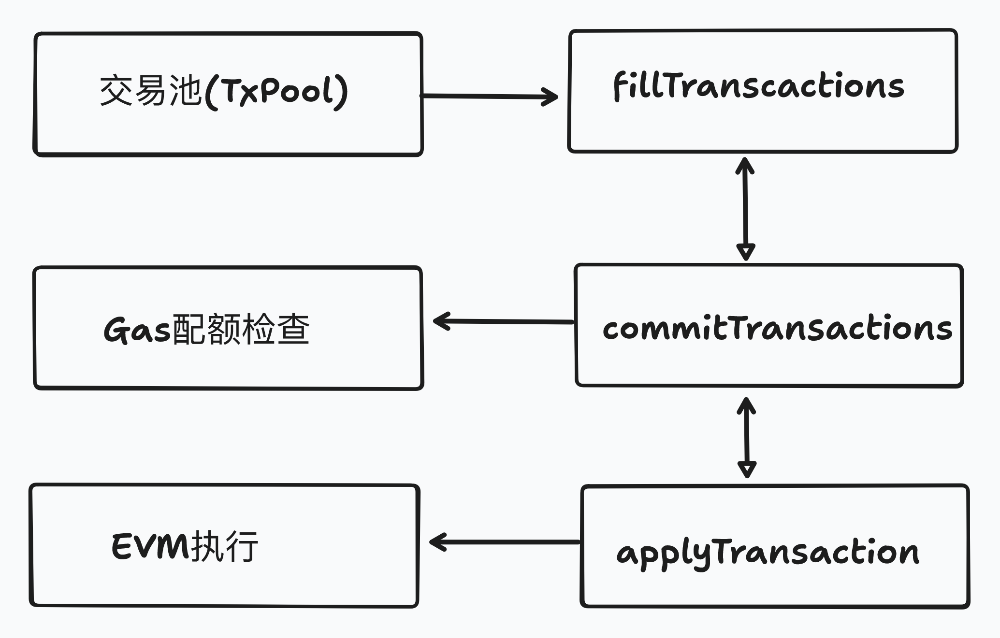

> 请在上边的 timezone 添加你的当地时区，这会有助于你的打卡状态的自动化更新，如果没有添加，默认为北京时间 UTC+8 时区
> 时区请参考以下列表，请移除 # 以后的内容

timezone: Pacific/Honolulu # 夏威夷-阿留申标准时间 (UTC-10)

timezone: America/Anchorage # 阿拉斯加标准时间 (UTC-9)

timezone: America/Los_Angeles # 太平洋标准时间 (UTC-8)

timezone: America/Denver # 山地标准时间 (UTC-7)

timezone: America/Chicago # 中部标准时间 (UTC-6)

timezone: America/New_York # 东部标准时间 (UTC-5)

timezone: America/Halifax # 大西洋标准时间 (UTC-4)

timezone: America/St_Johns # 纽芬兰标准时间 (UTC-3:30)

timezone: America/Sao_Paulo # 巴西利亚时间 (UTC-3)

timezone: Atlantic/Azores # 亚速尔群岛时间 (UTC-1)

timezone: Europe/London # 格林威治标准时间 (UTC+0)

timezone: Europe/Berlin # 中欧标准时间 (UTC+1)

timezone: Europe/Helsinki # 东欧标准时间 (UTC+2)

timezone: Europe/Moscow # 莫斯科标准时间 (UTC+3)

timezone: Asia/Dubai # 海湾标准时间 (UTC+4)

timezone: Asia/Kolkata # 印度标准时间 (UTC+5:30)

timezone: Asia/Dhaka # 孟加拉国标准时间 (UTC+6)

timezone: Asia/Bangkok # 中南半岛时间 (UTC+7)

timezone: Asia/Shanghai # 中国标准时间 (UTC+8)

timezone: Asia/Tokyo # 日本标准时间 (UTC+9)

timezone: Australia/Sydney # 澳大利亚东部标准时间 (UTC+10)

timezone: Pacific/Auckland # 新西兰标准时间 (UTC+12)

---

# {StarryDeserts}

1. 自我介绍

   第三次参加残酷共学，全靠这个学以太坊生态的知识了，我初学就直接干move了，对以太坊生态的很多具体细节都不够了解，希望在这里能够学到很多新知识，同时也增长下见识。

2. 你认为你会完成本次残酷学习吗？

   完全没问题！

## Notes

<!-- Content_START -->

### 2025.02.06

#### Protocol Design Philosophy（one day）

------

##### **核心原则**

**简洁性 (Simplicity)**

- 以太坊协议最初以简化设计为目标，强调普通开发者应能理解并实现整个协议。随着发展，模块化设计（如**`Proto-Danksharding`**）帮助维持了简洁性，复杂功能被封装为独立模块（如Dagger、Patricia树）。

**通用性 (Universality)**

- 以太坊不预设特定功能，而是通过**EVM**提供图灵完备的虚拟机，允许开发者构建任意数学定义的智能合约。目标是成为无需信任的去中心化应用平台。

**模块化 (Modularity)**

- 协议设计强调组件解耦，使得单个模块的修改不影响整体系统。例如，存储结构（**`LevelDB`**）、序列化工具（**`SSZ`**）等作为独立库存在，便于复用和升级。

**非歧视性 (Non-discriminant)**

- 协议不限制特定用途，仅通过交易费用机制防止滥用（如无限循环脚本需持续付费）。体现了FOSS（自由开源）和密码朋克精神。

**敏捷性 (Agility)**

- 协议通过**EIP（以太坊改进提案）**开放演进，对高层组件（如EVM）的修改需谨慎，但发现优化机会时果断调整。

------

##### **设计原则**

**管理复杂性 (Managing Complexity)**

- **三明治模型**：核心层（共识）和用户接口保持简单，复杂性封装在中间层（编译器、序列化脚本等）。
- **复杂性优先级**：Layer 2 > 客户端实现 > 协议规范，确保核心层稳定。

**自由 (Freedom)**

- 用户使用协议不受限制，避免类似比特币的“OP_RETURN限制”等歧视性规则。通过**Pigovian税**（交易费）让资源消耗者承担成本。

**泛化 (Generalization)**

- 操作码设计追求底层化，例如将“事件日志”从交易中分离为独立`LOG`指令，而非硬编码到消息结构。

**无特性 (We Have No Features)**

- 拒绝内置高频用例（如比特币的锁定时间），鼓励通过合约实现子协议。例如，通过签名数据包模拟锁仓功能。

------

##### 关键思考点

- **模块化如何促进创新**：Proto-Danksharding为Layer 2扩展提供基础模块，验证了模块化设计的灵活性。
- **复杂性封装的意义**：将LevelDB接口与核心共识分离，降低开发者参与门槛，同时支持未来存储方案的替换。


### 2025.02.07

#### Protocol Design Philosophy（two day）

------

##### **账户模型 vs. UTXO**

- **UTXO缺点**：隐私虽高但结构复杂，难以支持智能合约（如去中心化交易所）。
- **账户优势**：
  1. **空间效率**：账户存储占用更低（30字节 vs. UTXO的300字节）。
  2. **同质化**：账户余额完全可互换，无UTXO的“污染”问题。
  3. **防重放攻击**：通过递增`nonce`实现，但需解决废弃账户存储问题（如引入区块号限时重置）。

------

##### **数据结构演进**

1. **Merkle Patricia Trie (MPT)**
   - 结合Merkle树和Patricia算法，实现O(log n)的插入/查询效率，状态根哈希保证数据不可篡改。
   - **问题**：状态膨胀（1-2TB）导致节点存储压力，推动**无状态性**研究。
2. **Verkle树**
   - 通过向量承诺（Vector Commitments）缩小证明体积，支持更高效的轻客户端验证。
   - 分支因子`k`权衡带宽与计算，目标取代MPT以支持未来扩容。

------

##### **序列化协议**

1. **RLP (Recursive Length Prefix)**
   - 仅编码结构（嵌套数组），无数据类型定义，确保确定性序列化。
   - 缺点：不支持高效默克尔化（Merkleization），影响无状态性。
2. **SSZ (Simple Serialize)**
   - 引入固定类型和默克尔化，提升哈希计算效率（O(1) vs. RLP的O(n)），成为Eth2核心序列化方案。

------

##### **共识与最终性**

- **Casper FFG**：通过两轮验证者投票实现最终性，惩罚33%质押ETH的恶意行为。
- **LMD-GHOST**：选择最重子链的分叉规则，结合Casper形成**Gasper**共识协议，平衡安全性与活性。

------

##### **网络层设计**

- **DHT (Kademlia)**：用于节点发现（ENR记录），提供去中心化的路由表维护。
- **Gossip协议**：区块传播通过无结构网络（如gossipsub）实现高鲁棒性，DHT仅用于引导而非数据传输。

------

##### 技术挑战与趋势

- **状态爆炸**：Verkle树与无状态客户端是解决存储压力的关键路径。
- **混合网络模型**：DHT（结构化）与Gossip（无结构）结合，平衡全局发现与高效传播。


### 2025.02.08

#### 以太坊协议的历史与演进

------

#### **Frontier阶段（2015.7.30）**

- **定位**：以太坊首个测试版协议，允许开发者实验和构建去中心化应用。
- **关键特性**：
  1. **初始Gas限制**：创世区块启动时硬编码Gas上限为5000，后通过**解冻分叉**提升至314万（3,141,592），为早期网络启动提供缓冲。
  2. **金丝雀合约（Canary Contracts）**：
     - 功能：通过返回`0`或`1`信号控制客户端行为，若检测到多个合约返回`1`，客户端停止挖矿并提示升级。
     - 目的：防止长期网络分裂，确保矿工及时响应协议升级。

------

#### **Homestead阶段（2016.3.14）**

- **意义**：标志以太坊从测试版转向成熟稳定平台。
- **核心升级（EIPs）**：
  1. **EIP-2**（多项改进）：
     - **合约创建Gas成本提升**：从21,000增至53,000，抑制通过交易创建合约的滥用行为。
     - **高s值签名失效**：防止交易哈希被篡改（如s值取`secp256k1n/2`以上时无效）。
     - **合约创建失败处理**：Gas不足时直接失败，避免生成空合约。
     - **难度调整算法优化**：动态调整出块时间，提升网络稳定性。
  2. **EIP-7**：新增`DELEGATECALL`操作码。
     - **作用**：允许子合约继承父合约的`msg.sender`和`msg.value`，支持代码库复用（如代理合约模式）。
     - **与CALLCODE区别**：不附加Gas津贴，Gas管理更可控。
  3. **EIP-8**：网络协议向前兼容性。
     - **原则**：遵循**Postel法则**（“对输出严格，对输入宽容”），客户端忽略未知协议版本/字段，确保未来升级平滑过渡。

------

#### **The Merge（2022.9.15）**

- **核心变革**：共识机制从PoW（工作量证明）转向PoS（权益证明）。
- **实现路径**：
  1. **分层架构**：
     - **执行层**：处理交易与智能合约（原PoW逻辑层）。
     - **共识层**：由**信标链（Beacon Chain）**提供PoS共识（独立P2P网络），自2020年12月运行验证。
  2. **EIP-3675**：正式弃用PoW，合并执行层与共识层。
- **影响**：
  - 能源消耗降低99.95%，终结矿机挖矿时代。
  - 为后续扩容（分片）和安全性升级（最终性机制）奠定基础。

------

#### 思考

**Homestead的奠基作用**：

- `DELEGATECALL`推动智能合约可组合性，成为DeFi和代理合约（如ERC-1967）的技术支柱。
- EIP-8的兼容性设计使以太坊网络具备长期演进能力。

**Merge的意义与挑战**：

- **去中心化增强**：PoS降低参与门槛，但需解决质押中心化风险。
- **技术复杂性**：分层架构要求执行层与共识层紧密协同，验证者客户端（如Prysm、Lighthouse）的稳定性成为关键。

**历史演进的模式**：

- 从**功能验证（Frontier）到稳定扩展（Homestead）**，再到**架构重构（Merge）**，体现以太坊“敏捷迭代，长期主义”的技术哲学。


### 2025.02.09

#### 以太坊执行层规范（第1天）

------

#### **状态转换函数（State Transition Function）**

- **核心作用**：回答两个关键问题——

  1. 当前区块能否被添加到区块链末尾？
  2. 添加后状态如何变化？

- **公式表示**：

  $$\sigma_{t+1} \equiv \Pi(\sigma_t, B)$$

  - $$\sigma_t$$：前一区块状态
  - $$B$$：当前区块
  - $$\Pi$$：区块级状态转换函数，处理交易并更新状态

- **实现步骤**：

  1. 获取父区块头（Parent Header）
  2. 验证"Excess Blob Gas"（EIP-4844引入的Blob交易相关参数）
  3. 检查区块头字段（时间戳、Gas限制等）
  4. 执行区块内交易，生成状态根、日志等
  5. 验证执行结果与区块头是否一致

------

#### **区块头验证（Block Header Validation）**

- **关键校验项**：
1. **Gas限制约束**：子区块Gas限制需在父区块的±1/1024范围内，防止突变：
     $$\begin{cases}
     H_{\text{gasLimit}} < P(H)_{\text{gasLimit}} + \left\lfloor \frac{P(H)_{\text{gasLimit}}}{1024} \right\rfloor & (57b) \\
     H_{\text{gasLimit}} > P(H)_{\text{gasLimit}} - \left\lfloor \frac{P(H)_{\text{gasLimit}}}{1024} \right\rfloor & (57c)
     \end{cases}$$
  
2. **时间戳顺序**：$$H_{\text{timestamp}} > P(H)_{\text{timestamp}}$$（57e）
  
3. **Nonce与难度归零**：$$H_{\text{difficulty}} = 0$$（57k），$$H_{\text{nonce}} = \texttt{0x0000000000000000}$$（57l）
  
4. **Blob Gas限制**：单区块Blob Gas上限为786,432（57p），且必须为217的整数倍（57q）

------

#### **数据结构与数学基础**

- **状态树（Merkle Patricia Trie）**：

  - 存储账户状态，通过TRIE函数生成状态根哈希。

  - 示例：账户存储根计算（公式7）：

    $$\text{TRIE}(LI^*(\sigma[a]_s)) \equiv \sigma[a]_s$$

    - $$LI((k,v)) \equiv (\text{KEC}(k), \text{RLP}(v))$$

- **自然数（$$\mathbb{N}$$）的应用**：

  - Gas相关参数（如$$H_{\text{gasUsed}}`、`H_{\text{gasLimit}}$$）使用自然数，确保计算精确性。


### 2025.02.10

#### 以太坊执行层规范（第2天）

##### **经济模型与Gas动态**

- **EIP-1559机制**：

  - **基础费用调整公式**：
    $$\nu = 
    \begin{cases}
    \left\lfloor \frac{P(H)_{\text{baseFeePerGas}} \times (\tau - P(H)_{\text{gasUsed}})}{\tau \times \xi} \right\rfloor & \text{if } P(H)_{\text{gasUsed}} < \tau \\
    \max\left(\left\lfloor \frac{P(H)_{\text{baseFeePerGas}} \times (P(H)_{\text{gasUsed}} - \tau)}{\tau \times \xi} \right\rfloor, 1\right) & \text{if } P(H)_{\text{gasUsed}} > \tau
    \end{cases}$$
    - $$\xi= 8$$（控制基础费用最大变化率）
  
- **模拟分析**：
  - 基础费用在目标附近呈线性变化（见下图）：
    

------

##### **Blob Gas定价机制**

- **超额Blob Gas计算**：
  
  $$\text{CalcExcessBlobGas}(P(H)) = 
  \begin{cases}
  0 & \text{if } P(H)_{\text{blobGasUsed}} < \text{TargetBlobGasPerBlock} \\
  P(H)_{\text{blobGasUsed}} - \text{TargetBlobGasPerBlock} & \text{otherwise}
  \end{cases}$$
  
  - $$\text{TargetBlobGasPerBlock} = 393,216$$
  
- **Blob Gas价格公式**：
  $$\text{BlobGasPrice} = \text{fake\_exponential}\left(1, \frac{\text{excessBlobGas}}{3,338,477}\right)$$

  - 模拟显示持续超额时价格指数上升（见下图）：
    


### 2025.02.11

#### 以太坊执行层规范（第3天）

------

##### **交易执行与EVM机制**

- **执行阶段**：

  1. **检查点状态（$$\sigma_0$$）**：
     $$\sigma_0 \equiv \sigma \quad \text{except:} \quad 
     \begin{cases}
     \sigma_0[\text{Sender}]_{\text{balance}} = \sigma[\text{Sender}]_{\text{balance}} - \text{upfrontCost} \\
     \sigma_0[\text{Sender}]_{\text{nonce}} = \sigma[\text{Sender}]_{\text{nonce}} + 1
     \end{cases}$$

- **EVM状态机**：
  - **寄存器定义**：
    $$\mu \equiv (\mu_{\text{gasAvailable}}, \mu_{\text{programCounter}}, \mu_{\text{memoryContents}}, \mu_{\text{activeWordsInMemory}}, \mu_{\text{stackContents}})$$

------

##### **合约创建流程**

1. **地址生成**：
   $$\text{地址} = \text{KEC}(\text{RLP}([\text{Sender}_{\text{address}}, \text{Sender}_{\text{nonce}} - 1]))[-20:]$$

2. **账户初始化**：
   $$\sigma^*[\text{newAccount}] \equiv (\text{Nonce}=1, \text{Balance}=T_{\text{value}}, \text{Storage}=\text{TRIE}(\emptyset), \text{CodeHash}=\text{KEC}(()))$$

------

##### **Gas计算模型**

- **内存扩展成本**：
  $$\text{MemoryExpansionCost} = 3 \times \Delta_{\text{expansion}} + \left\lfloor \frac{\Delta_{\text{expansion}}^2}{512} \right\rfloor$$
  - $$\Delta_{\text{expansion}}$$：新增内存块数

------

##### **R代码：基础费用模拟**

```R
calculate_base_fee_per_gas <- function(
  parent_gas_limit, parent_gas_used, parent_base_fee_per_gas,
  max_change_denom = 8, elasticity_multiplier = 2
) {
  parent_gas_target <- parent_gas_limit %/% elasticity_multiplier
  if (parent_gas_used == parent_gas_target) {
    parent_base_fee_per_gas
  } else if (parent_gas_used > parent_gas_target) {
    gas_used_delta <- parent_gas_used - parent_gas_target
    base_fee_per_gas_delta <- max(
      (parent_base_fee_per_gas * gas_used_delta %/% parent_gas_target) %/% max_change_denom,
      1
    )
    parent_base_fee_per_gas + base_fee_per_gas_delta
  } else {
    gas_used_delta <- parent_gas_target - parent_gas_used
    base_fee_per_gas_delta <- (parent_base_fee_per_gas * gas_used_delta %/% parent_gas_target) %/% max_change_denom
    parent_base_fee_per_gas - base_fee_per_gas_delta
  }
}
```


### 2025.02.12

#### 以太坊执行层架构（第1天）

------

##### **客户端架构概览**

###### 核心职责

1. **区块链数据验证与存储**
   - 维护本地区块链副本
   - 通过默克尔树验证数据完整性
2. **网络通信**
   - 使用DevP2P协议进行点对点通信
   - 交易池（mempool）管理
3. **共识层协作**
   - 实现Engine API接口
   - 响应`forkChoiceUpdated`和`newPayload`调用

##### 分层架构


------

##### **EVM设计原理**

###### 虚拟机核心特征

- **硬件无关性**
  通过`EVM字节码`实现跨平台一致性，类似JVM设计理念
- **沙盒环境**
  每个交易在隔离环境中执行，保证状态变更原子性

###### 三明治复杂性模型

1. **外层（简单）**
   - Solidity/Yul等高级语言
   - JSON-RPC接口
2. **中间层（复杂）**
   - 编译器（Solidity→EVM字节码）
   - Gas计量系统
3. **内层（简单）**
   - EVM指令集（约140个操作码）

------

##### **状态管理机制**

###### 全局状态组成

| 组件     | 存储内容                | 数据结构        |
| -------- | ----------------------- | --------------- |
| 账户状态 | 余额/Nonce/合约代码哈希 | Merkle-Patricia |
| 合约存储 | 智能合约变量数据        | Merkle-Patricia |
| 交易收据 | 交易执行日志            | Bloom Filter    |

###### 状态转换公式
$$\sigma_{t+1} \equiv \Upsilon(\sigma_t, T)$$

- $$\sigma_t$$: 当前状态
- $$T$$: 交易集合
- $$\Upsilon$$: 状态转换函数

------

##### **交易生命周期**

###### 处理流程

1. **接收**
   通过JSON-RPC接口接收签名交易
2. **验证**
   - 签名有效性
   - Nonce连续性
   - Gas预算充足
3. **传播**
   通过DevP2P协议广播至全网节点
4. **打包**
   被矿工/验证者选入候选区块
5. **执行**
   在EVM中触发状态转换

###### Gas计算模型
$$\text{总Gas成本} = \text{固有成本} + \sum(\text{操作码Gas} \times \text{执行次数})$$

------

##### **网络层（DevP2P）**

###### 关键协议

| 协议   | 功能         | 传输内容      |
| ------ | ------------ | ------------- |
| eth/66 | 区块同步     | 区块头/体数据 |
| eth/67 | 交易传播     | 原始交易数据  |
| les/4  | 轻客户端支持 | 状态证明      |

###### 节点发现机制

1. 使用Kademlia DHT协议
2. 通过ENR记录存储节点元数据
3. 维护动态路由表（Bucket结构）


### 2025.02.13

#### 以太坊执行层架构学习笔记（第2天）

------

##### **引擎API（Engine API）**

###### 核心接口

```go
type EngineAPI interface {
    NewPayloadV1(payload ExecutionPayload) (PayloadStatusV1, error)
    ForkchoiceUpdatedV1(state ForkchoiceState, attr PayloadAttributes) (ForkchoiceUpdatedResult, error)
}
```

###### 工作流程

1. **共识层触发**
   - 接收`ForkchoiceUpdated`调用
   - 确定规范链头（head block）
2. **有效载荷验证**
   - 检查父块哈希一致性
   - 验证时间戳序列
3. **状态同步**
   - 执行区块内交易
   - 更新全局状态树

------

##### **同步机制**

###### 同步模式对比

| 模式     | 特点                     | 适用场景         |
| -------- | ------------------------ | ---------------- |
| 全量同步 | 从创世块开始验证所有交易 | 新节点初始化     |
| 快速同步 | 下载最新状态快照         | 追赶网络最新状态 |
| 轻同步   | 仅同步区块头+Merkle证明  | 移动设备/浏览器  |

###### 状态同步公式

$$\text{同步进度} = \frac{\text{已验证区块高度}}{\text{网络最新高度}} \times 100\%$$

------

##### **有效载荷验证流程**

###### 验证步骤

1. **区块头验证**

   $$H_{\text{gasLimit}} \in \left[P(H)_{\text{gasLimit}} \pm \left\lfloor \frac{P(H)_{\text{gasLimit}}}{1024} \right\rfloor\right]$$

2. **随机数验证**

   - $$H_{\text{difficulty}} = 0$$ (PoS区块)
   - $$H_{\text{nonce}} = 0x0000000000000000$$

3. **时间戳验证**

   

   $$H_{\text{timestamp}} > P(H)_{\text{timestamp}}$$

###### 客户端实现差异

| 检查项       | Geth实现位置              | Reth实现位置        |
| ------------ | ------------------------- | ------------------- |
| Gas限制验证  | `core/block_validator.go` | `crates/engine/src` |
| 基础费用计算 | `core/fee_history.go`     | `crates/revm/src`   |

------

##### **交易池管理**

###### 双池架构


###### 淘汰机制对比

| 池类型 | 排序依据                  | 淘汰策略           |
| ------ | ------------------------- | ------------------ |
| Legacy | 有效小费（Effective Tip） | 大顶堆淘汰低优先级 |
| Blob   | 对数时间衰减              | 滑动窗口淘汰       |

------

##### **共识引擎集成**

###### 多引擎支持

```go
type ConsensusEngine interface {
    VerifyHeaders(chain BlockChain, headers []*Header) (chan<- struct{}, <-chan error)
    Finalize(chain BlockChain, header *Header, state *state.StateDB, txs []*Transaction)
}
```

###### 验证流程示例

1. 分离PoW/PoS区块头
2. 预合并区块使用Ethash验证
3. 后合并区块通过Beacon链验证
4. 检查终态性（Finality）标记


### 2025.02.14

#### 以太坊区块构建与交易处理学习笔记

------

##### **区块构建概览**

###### 核心参与方

1. **共识层（CL）**
   - 负责验证者选举
   - 确定区块提案者
   - 通过Engine API触发执行层构建区块
2. **执行层（EL）**
   - 维护交易池（mempool）
   - 执行交易并生成有效载荷（Payload）
   - 实现状态转换函数

###### 构建流程触发

- **触发条件**：验证者通过`engine_forkchoiceUpdatedV2`接口接收构建指令

- **输入参数**：

  $$\text{PayloadAttributes} = \{ \text{timestamp}, \text{prev\_hash}, \text{base\_fee}, ... \}$$

------

##### **区块构建核心流程**

###### 初始化空区块

```go
func buildPayload(env *Environment) (*ExecutionPayload, error) {
    emptyBlock := createEmptyBlock(env)  // 创建基准空区块
    go asyncFillBlock(emptyBlock)        // 异步填充交易
    return emptyBlock, nil
}
```

- **目的**：确保在时间窗口内至少有空区块可提议
- **异步优化**：后台继续完善区块内容

###### 交易填充机制



- **排序规则**：优先选择gas费率高且nonce连续的交易

- **Gas配额管理**：

  $$\sum(\text{tx.gasLimit}) \leq 30,000,000 \quad (\text{当前主网Gas上限})$$

###### 交易执行与状态转换

```go
func applyTransaction(tx *Transaction, state *StateDB) error {
    evm := NewEVM(Context{Block: env}, state)
    result, err := evm.Run(tx)  // 执行交易
    if err != nil {
        return err  // 失败交易被丢弃
    }
    state.ApplyResult(result)   // 更新状态
    return nil
}
```

- **原子性保证**：单笔交易失败不影响区块整体有效性

- **状态树更新**：

  $$\sigma_{new} = \Upsilon(\sigma_{old}, tx)$$

------

##### **关键组件解析**

###### 交易池（TxPool）

- **数据结构**：
  - **Pending队列**：已验证待打包交易
  - **Queued队列**：nonce不连续交易
- **淘汰策略**：
  - **Legacy交易**：按gas价格大顶堆淘汰
  - **Blob交易**：按时间衰减窗口淘汰

###### EVM执行环境

| 环境变量          | 来源              | 示例值     |
| ----------------- | ----------------- | ---------- |
| `block.timestamp` | PayloadAttributes | 1700000000 |
| `block.number`    | 父区块高度+1      | 18923456   |
| `block.basefee`   | EIP-1559动态计算  | 15 Gwei    |

------

##### **错误处理机制**

###### 交易级别错误

- **类型**：
  - Gas不足（OutOfGas）
  - 无效操作码（InvalidOpcode）
  - 合约回滚（Revert）
- **处理方式**：
  - 丢弃无效交易
  - 继续尝试打包后续交易

区块级别错误

- **类型**：
  - GasLimit超标
  - 时间戳不连续
- **处理方式**：
  - 终止当前构建流程
  - 触发CL重新选择提案者

------

##### **性能优化策略**

1. **异步填充**：先返回空区块再完善内容
2. **交易预验证**：维护已验证交易池
3. **状态快照**：使用`StateDB`的快照功能快速回滚
4. **并行执行**：实验性支持多交易并行执行


### 2025.02.15

#### 以太坊执行层数据结构学习笔记

------

##### **核心数据结构概览**

###### 默克尔树（Merkle Tree）

- **结构特性**

  

- **核心机制**：

  - 叶子节点存储数据哈希值
  - 非叶子节点存储子节点哈希的拼接哈希
  - 根哈希存储在区块头中

- **数据完整性验证**：

  - $$\text{篡改检测} \Rightarrow \Delta Data \rightarrow \Delta LeafHash \rightarrow \Delta RootHash$$

###### 前缀树（Patricia Tree）

- **优化特性**：
  - 共享前缀压缩（如`0x12A`和`0x12B`共享`0x12`路径）
  - 节点类型精简（分支/扩展/叶子）
- **存储效率**：
  - $$\text{传统Trie空间复杂度} O(n) \rightarrow \text{Patricia空间复杂度} O(k) \quad (k为键长)$$

###### 默克尔前缀树（MPT）

- **混合设计**：

  - 继承Merkle的完整性验证
  - 采用Patricia的存储优化

- **节点类型**：

  | 节点类型 | 结构描述                    | 示例场景       |
  | -------- | --------------------------- | -------------- |
  | 分支节点 | 17元素数组（16分支+值指针） | 路径分叉点     |
  | 扩展节点 | [压缩路径, 子节点哈希]      | 单一路径段压缩 |
  | 叶子节点 | [剩余路径, 值数据]          | 键值对存储终点 |

------

##### **以太坊中的MPT应用**

###### 四大核心Trie结构

| Trie类型     | 存储内容                     | 更新频率     | 根哈希位置                |
| ------------ | ---------------------------- | ------------ | ------------------------- |
| 交易Trie     | 区块内所有交易               | 区块不可变   | BlockHeader.txRoot        |
| 收据Trie     | 交易执行结果（日志/Gas消耗） | 区块不可变   | BlockHeader.receiptRoot   |
| 世界状态Trie | 所有账户的当前状态           | 区块可变     | BlockHeader.stateRoot     |
| 账户存储Trie | 智能合约的持久化变量         | 合约调用可变 | 账户对象的storageRoot字段 |

###### 交易Trie构建规则

- **键值编码**：
  - $$Key = RLP(交易索引) \quad Value = RLP(交易数据)$$

- **交易数据结构**：

  ```go
  type Transaction struct {
      Nonce    uint64
      GasLimit uint64
      To       common.Address
      Value    *big.Int
      Data     []byte
      V, R, S  *big.Int // 签名
  }
  ```

------

##### **RLP编码规范**

###### 编码规则

- **基本类型**：

  - 字符串：直接编码为字节序列
  - 整数：大端序无前缀零编码

- **嵌套结构**：

  - $$RLP([a, b, c]) = RLP(a) \oplus RLP(b) \oplus RLP(c)$$

- **长度标识**：

  | 数据长度 | 前缀字节         |
  | -------- | ---------------- |
  | 0-55字节 | 0x80 + len       |
  | >55字节  | 0xB7 + len字节数 |

###### 应用场景

- 交易/收据的序列化存储
- 状态树节点的键值编码
- 网络传输数据封装

------

##### **MPT节点哈希机制**

###### 哈希计算流程

1. **序列化节点**：使用RLP编码节点内容
2. **Keccak-256哈希**：
   - $$nodeHash = \text{Keccak256}(RLP(nodeContent))$$
3. **递归计算**：子节点哈希参与父节点哈希生成

###### 安全特性

- **雪崩效应**：单字节修改导致根哈希完全变化
- **防碰撞保证**：
  - $$P(\text{哈希碰撞}) \approx \frac{1}{2^{256}} \approx 10^{-77}$$

------

##### **MPT操作示例**

###### 数据插入流程

1. 从根节点开始匹配键路径
2. 遇到扩展节点时展开共享前缀
3. 在分支节点处分叉
4. 创建新叶子节点存储值
5. 自底向上更新路径上的所有节点哈希


### 2025.02.16

#### 以太坊交易与合约创建解析

------

##### **交易（Transaction）结构解析**

1. **核心字段**：

   - **Nonce**：
     - 用途：防止重放攻击、确定合约地址、替换卡顿交易。
     - 示例：首次交易 Nonce=0，递增保证唯一性。
   - **gasPrice**（单位：Wei）：
     - 决定交易优先级，矿工优先打包高 gasPrice 的交易。
   - **gasLimit**：
     - 交易执行的最大 Gas 消耗量，不足则执行中断。
   - **to**：
     - 为空：合约创建模式。
     - 外部账户地址：转账模式。
     - 合约地址：调用合约函数。
   - **value**（单位：Wei）：
     - 转账金额（若为合约创建，则为新合约初始余额）。
   - **data/init**：
     - 合约创建模式：`init` 字节码（部署时执行，返回 runtime 代码）。
     - 其他模式：调用合约的输入数据（如函数参数）。
   - **签名**（Signature）：
     - ECDSA 签名，验证交易合法性。

2. **交易模式**：

   | `to` 字段值  | 模式     | 描述               |
   | ------------ | -------- | ------------------ |
   | 空           | 合约创建 | 创建新合约账户     |
   | 外部账户地址 | 转账     | 向外部账户转移 ETH |
   | 合约账户地址 | 合约调用 | 执行合约代码       |

------

##### **合约创建流程示例**

1. **目标合约代码**：

   ```solidity
   // Runtime 代码（执行 6*7=42 并存储）
   [0c] PUSH1 06
   [0e] PUSH1 07
   [10] MUL
   [11] PUSH1 0
   [13] SSTORE
   ```

2. **Init 代码构造**：

   - **功能**：将 Runtime 代码复制到内存并返回。
   - **步骤**：
     1. 使用 `CODECOPY` 复制代码到内存。
     2. `RETURN` 返回内存中的 Runtime 代码。

   ```javascript
   // Init 字节码
   6008600c60003960086000f3 // 复制代码到内存并返回
   6006600702600055         // Runtime 代码（6*7）
   ```

3. **部署交易参数**：

   ```json
   [
     "0x",                    // Nonce=0（首次交易）
     "0x77359400",            // gasPrice=2 Gwei
     "0x13880",               // gasLimit=80000
     "0x",                    // to=空（合约创建模式）
     "0x05",                  // 向合约转账 5 Wei
     "0x6008600c60003960086000f36006600702600055" // init 代码
   ]
   ```

4. **工具使用（Foundry）**：

   - **Anvil**：启动本地测试节点。

     ```bash
     $ anvil  # 启动节点，生成测试账户
     ```

   - **Cast**：签名并发布交易。

     ```bash
     $ cast publish <RAW_TX>  # 发布交易
     $ cast code <CONTRACT_ADDRESS>  # 查询合约代码
     $ cast storage <CONTRACT_ADDRESS> 0x  # 查询存储槽0的值
     ```

------

##### **合约执行验证**

1. **调用合约交易**：

   ```json
   [
     "0x1",                   // Nonce=1（递增）
     "0x77359400",            // gasPrice=2 Gwei
     "0x13880",               // gasLimit=80000
     "0x5fbdb2315678afecb367f032d93f642f64180aa3", // 合约地址
     "0x",                    // value=0（不转账）
     "0x"                     // data=空（触发默认函数）
   ]
   ```

2. **验证结果**：

   ```bash
   $ cast storage 0x5fbdb... 0x
   # 输出 0x2a（即 42，6*7 的结果）
   ```

------

##### **总结**

1. **交易字段协作**：Nonce 防重放、gas 控制资源、to/data 决定行为。
2. **合约生命周期**：
   - Init 代码（一次性执行） → 返回 Runtime 代码（持久存储）。
   - 后续交易通过 `to` 指向合约地址调用代码。
3. **工具链**：Foundry（Anvil + Cast）简化本地测试与调试。


### 2025.02.17

#### 以太坊 RLP 序列化协议解析

------

##### **RLP 概述**

- **定义**：递归长度前缀（RLP）是以太坊执行层核心的序列化协议，用于将数据编码为字节流，支持交易数据、区块链状态等结构化数据的存储与传输。
- **设计目标**：
  - **极简主义**：仅编码嵌套字节数组（无特定数据类型定义）。
  - **一致性**：确保不同客户端（如 geth、Nethermind）的字节级一致性。
  - **递归性**：支持嵌套结构（如列表中的列表）。

------

##### **RLP 编码规则**

根据数据类型和长度，RLP 编码分为以下类别：

1. **单字节编码**

   - **条件**：值在 `0x00`~`0x7F` 之间。
   - **编码**：直接保留原值。
   - **示例**：`0x2a` → `0x2a`。

2. **短字符串（1-55字节）**

   - **条件**：长度 ≤55 字节。
   - **编码**：前缀为 `0x80 + 长度`，后接字符串。
   - **示例**：`"dog"`（0x64 6f 67）→ `[0x83, 0x64, 0x6f, 0x67]`。

3. **长字符串（>55字节）**

   - **条件**：长度 >55 字节。
   - **编码**：前缀为 `0xb7 + 长度字节数`，后接长度（大端序），再跟字符串。
   - **示例**：长度 56 → `[0xb8, 0x38, ...数据...]`。

4. **短列表（总负载 1-55字节）**

   - **条件**：列表项编码后总长度 ≤55 字节。
   - **编码**：前缀为 `0xc0 + 总长度`，后接各编码项。
   - **示例**：列表 `["cat", "dog"]` → `[0xc8, 0x83, 'c','a','t', 0x83, 'd','o','g']`。

5. **长列表（总负载 >55字节）**

   - **条件**：总负载 >55 字节。
   - **编码**：前缀为 `0xf7 + 长度字节数`，后接长度（大端序），再跟列表项。
   - **示例**：总长度 57 → `[0xf8, 0x39, ...编码项...]`。

6. **特殊值处理**

   | 类型                | 编码   |
   | ------------------- | ------ |
   | 空字符串/null/false | `0x80` |
   | 空列表              | `0xc0` |

------

##### **RLP 解码规则**

解码流程基于前缀字节：

1. **确定数据类型**

   - **前缀范围**决定类型：

     | 前缀范围      | 类型     | 规则                     |
     | ------------- | -------- | ------------------------ |
     | `0x00`~`0x7F` | 单字节   | 直接取值                 |
     | `0x80`~`0xB7` | 短字符串 | 长度 = 前缀 - 0x80       |
     | `0xB8`~`0xBF` | 长字符串 | 长度字节数 = 前缀 - 0xB7 |
     | `0xC0`~`0xF7` | 短列表   | 总长度 = 前缀 - 0xC0     |
     | `0xF8`~`0xFF` | 长列表   | 长度字节数 = 前缀 - 0xF7 |

2. **递归解码**

   - **嵌套结构**：对列表内的每个项递归应用解码规则。
   - **示例**：解码 `[0xc8, 0x83, 0x63, 0x61, 0x74, 0x83, 0x64, 0x6f, 0x67]`：
     - 前缀 `0xc8` → 列表总长度 8 字节。
     - 拆解为 `["cat", "dog"]`（`0x83`前缀解码每个字符串）。

------

##### **RLP 在以太坊中的应用**

- **核心场景**：
  - **交易数据**：编码交易的字段（如 nonce、gasPrice）。
  - **区块链状态**：编码账户信息、存储树等。
  - **网络传输**：确保不同客户端间数据一致性。
- **对比其他协议**：
  - **与 JSON/Protobuf**：RLP 无类型定义，仅专注结构。
  - **与 SSZ**：SSZ（共识层使用）支持高效 Merkle 化，RLP 更轻量。

------

##### **总结**

- **设计哲学**：极简、确定性和递归兼容性。
- **编码核心**：前缀标识类型与长度，递归处理嵌套结构。
- **实践意义**：理解 RLP 是以太坊合约开发、客户端实现和链数据分析的基础。


### 2025.02.18

##### 以太坊共识层基础与 Beacon Chain 架构

------

###### **共识层的核心目标**

- **核心挑战**：
  - 在不可靠的全球节点网络（延迟/恶意节点）中实现账本一致性。
  - 所有节点必须对交易顺序和状态达成**确定性共识**。
- **共识协议角色**：
  - **LMD GHOST**：动态选择最长有效链（类似 PoW 的链选择规则）。
  - **Casper FFG**：实现最终性（Finality），确保不可逆确认。
  - 两者结合称为 **Gasper** 协议。

------

###### **从 PoW 到 PoS 的过渡**

- **PoW 的局限性**：
  - 高能耗、低扩展性、中心化矿池风险。
- **PoS 的优势**：
  - **质押经济模型**：验证者需质押 32 ETH，恶意行为导致罚没。
  - **随机化选择**：通过 RANDAO + VDF 生成不可预测的随机数选择出块者。
  - **最终性机制**：通过检查点（Checkpoints）实现交易不可逆。
- **合并（The Merge）**：
  - **触发条件**：终端总难度（TTD）阈值达成，而非区块高度。
  - **结果**：Beacon Chain 接管出块，执行层（用户交易）与共识层解耦。

------

###### **Beacon Chain 基础架构**

- **核心组件**：

  - **验证者（Validators）**：

    - 职责：提议区块（Proposer）和投票认证（Attester）。
    - 激活条件：质押 32 ETH 至官方合约，排队等待激活。

  - **时隙（Slot）与纪元（Epoch）**：

    | 概念 | 时间/结构           | 功能                                   |
    | ---- | ------------------- | -------------------------------------- |
    | 时隙 | 12 秒               | 基础时间单位，每个时隙尝试生成一个区块 |
    | 纪元 | 32 时隙（6.4 分钟） | 检查点生成周期，验证者委员会重组       |

- **验证者生命周期**：

  1. 质押 32 ETH → 进入激活队列
  2. 激活后参与提议/认证 → 持续获得奖励
  3. 退出条件：余额 <16 ETH 或主动退出（需 2048 纪元等待）
  4. 罚没（Slashing）：双签/FFG 违规 → 强制退出 + 质押金扣除

------

###### **关键机制解析**

- **RANDAO 与 VDF**：
  - **RANDAO**：基于验证者提交的随机数种子，生成伪随机数。
  - **VDF（可验证延迟函数）**：防止 RANDAO 被操控，确保随机性不可预测。
- **委员会（Committees）**：
  - 每个时隙分配至少 128 个验证者，降低攻击成功率（需控制 2/3 委员会成员）。
  - 委员会负责认证区块，签名可聚合优化网络负载。

------

###### **设计亮点**

- **分时分工**：时隙/纪元划分实现高效的分批验证。
- **经济激励**：质押机制与奖惩体系保障网络安全。
- **抗女巫攻击**：PoS 通过质押成本抵御低成本攻击。


### 2025.02.19

#### 委员会运行、最终性与奖惩机制

------

##### **委员会与区块认证**

- **委员会运作流程**：

  1. **随机分配**：每纪元开始时，验证者被随机分派到时隙和委员会。
  2. **双重投票**：

  - **LMD GHOST 投票**：选择当前最长有效链头。
  - **FFG 投票**：认证纪元边界检查点。

  1. **签名聚合**：同一委员会的认证可合并，减少链上数据量。

- **安全设计**：

  - **最小委员会规模**：128 验证者 → 攻击概率 <1/10¹²。
  - **快速最终性**：通过检查点累积认证，2 纪元（约 12.8 分钟）实现最终性。

------

##### **EIP-4844 与 Blobs**

- **Blob 设计**：
  - **数据可用性层**：临时存储大容量数据（如 L2 交易），降低主链负载。
  - **KZG 承诺**：使用多项式承诺验证 Blob 完整性，需可信设置（KZG Ceremony）。
  - **存储影响**：节点需额外 52~104GB 存储（默认保留 4096 纪元）。
- **实现意义**：
  - **扩容第一步**：为分片（Sharding）铺路，支持 Rollup 等 L2 方案。
  - **未来兼容**：支持构建者-提议者分离（PBS），优化 MEV 抵抗。

------

##### **检查点与最终性**

- **检查点规则**：
  - 每个纪元的第一个时隙区块作为检查点（若空缺则向前追溯）。
  - **合理性（Justification）**：检查点获得 2/3 验证者认证。
  - **最终性（Finalization）**：连续两个合理检查点 → 前一检查点不可逆。
- **最终性流程示例**：
  1. Epoch 1 检查点（Slot 32）获 70% 认证 → 标记为合理。
  2. Epoch 2 检查点（Slot 64）获 70% 认证 → Epoch 1 检查点最终化。
  3. 最终化后，Slot 32 之前的所有区块不可逆转。

------

##### **质押奖励与惩罚**

- **奖励类型**：

  | 类型       | 触发条件               | 收益比例             |
  | ---------- | ---------------------- | -------------------- |
  | 提议者奖励 | 成功出块并被最终化     | 高（约总奖励 1/8）   |
  | 认证者奖励 | 及时正确投票           | 基础奖励（按参与度） |
  | 举报奖励   | 提交其他验证者违规证据 | 罚没金额的提成       |

- **惩罚机制**：

  - **轻度惩罚**：离线/延迟认证 → 按时间扣除质押金。
  - **重度惩罚（Slashing）**：
    - **双签/FFG 违规**：至少罚没 1 ETH，最高全额罚没。
    - **不活跃泄漏**：网络无法最终化时，持续扣除离线验证者余额。

- **典型风险案例**：

  - **诚实验证者年化收益**：约 4-7%（取决于网络参与度）。
  - **严重违规成本**：32 ETH 质押金可能全部损失。

------

##### **总结与展望**

- **共识层价值**：PoS + Gasper 协议实现高效、环保的分布式共识。
- **未来升级**：EIP-4844 是分片的前奏，后续将引入完整数据分片与 PBS。
- **节点要求**：随着 Blob 引入，节点存储需求增长，需硬件迭代支持。


### 2025.02.20

#### 共识层架构基础与分叉选择机制

------

##### **分叉选择机制（Fork-choice Rules）**

- **核心目标**：
  在不可靠节点网络中选择最可能成为规范链的分支，确保所有诚实节点最终收敛到同一链历史。

- **常见分叉选择规则**：

  | 类型           | 适用场景          | 核心逻辑                                                     |
  | -------------- | ----------------- | ------------------------------------------------------------ |
  | PoW 最长链规则 | 比特币/早期以太坊 | 选择累计工作量（算力）最大的链                               |
  | Casper FFG     | PoS 最终性机制    | 遵循包含最高已证明检查点（Justified Checkpoint）的链，永不回滚最终化区块 |
  | LMD GHOST      | PoS 动态链选择    | 根据验证者投票权重选择「最贪婪最重子树」（Greediest Heaviest SubTree） |

- **LMD GHOST 工作逻辑**：

  1. 每个区块接收验证者的**最新消息驱动（Latest Message Driven）**投票
  2. 计算每个子树的总投票权重（验证者余额总和）
  3. 选择权重最大的子树分支作为链头（Head Block）

------

##### **区块树与重组（Block Tree & Reorgs）**

- **区块树结构**：

  - **根节点**：创世区块（Genesis Block）
  - **分支节点**：不同验证者提议的竞争区块
  - **链头（Head）**：当前分叉选择规则选中的最新区块

- **重组（Reorg）触发场景**：

  1. **网络延迟**：节点收到更优分支的滞后区块
  2. **恶意攻击**：攻击者尝试通过分叉实施双花
  3. **协议漏洞**：分叉选择规则实现错误

- **重组示例**：

  初始链：**A ← B ← D ← E ← F**
  新接收区块：**G（基于 C，C 基于 B）**
  重组后链：**A ← B ← C ← G**
  回滚区块：**D, E, F 被移除**

------

##### **安全性与活跃性（Safety & Liveness）**

- **CAP 定理约束**：
  - **一致性（Consistency）**：所有节点状态一致（安全性）
  - **可用性（Availability）**：系统持续响应（活跃性）
  - **分区容忍（Partition Tolerance）**：网络分裂时仍能运行
  - **以太坊选择**：优先保障活跃性，允许临时性分叉
- **Gasper 协议的双层设计**：
  - **LMD GHOST**：保障活跃性，持续产出新区块
  - **Casper FFG**：保障安全性，通过检查点实现最终性
  - **协同逻辑**：
    - LMD GHOST 动态选择链头
    - Casper FFG 定期固化历史区块（约 15 分钟）

------

##### **节点架构与组件**

- **共识层核心组件**：

  | 组件                             | 功能                                                      |
  | -------------------------------- | --------------------------------------------------------- |
  | 信标节点（Beacon Node）          | 同步信标链数据，参与 P2P 网络通信（如 Prysm、Lighthouse） |
  | 验证者客户端（Validator Client） | 管理质押 ETH，执行区块提议和认证（需与信标节点配对）      |

- **执行层（EL）与共识层（CL）协作**：

  1. 共识层接收区块 → 发送交易到执行层验证
  2. 执行层执行交易 → 返回状态根和 Gas 消耗
  3. 共识层验证状态根 → 广播认证（Attestation）


### 2025.02.21

#### 状态转换与验证逻辑

------

##### **信标链状态转换**

- **状态驱动机制**：

  - **时隙驱动（Slot-driven）**：每个时隙（12秒）触发状态更新，无论是否有新区块
  - **区块驱动（Block-driven）**：接收新区块时更新状态

- **状态转换函数**：

  ```python
  def state_transition(state: BeaconState, signed_block: SignedBeaconBlock):
      # 处理时隙过渡（包括空时隙）
      process_slots(state, block.slot)
      # 验证区块签名
      if validate_result:
          assert verify_block_signature(state, signed_block)
      # 处理区块内容
      process_block(state, block)
      # 验证状态根一致性
      if validate_result:
          assert block.state_root == hash_tree_root(state)
  ```

- **关键子函数**：

  | 函数              | 功能                                      |
  | ----------------- | ----------------------------------------- |
  | `process_slots()` | 处理时隙过渡，必要时触发纪元（Epoch）处理 |
  | `process_epoch()` | 纪元结束时更新验证者状态、惩罚机制等      |
  | `process_block()` | 处理区块内的认证、质押操作等              |

------

##### **区块验证条件**

- **有效性校验**：
  1. **签名验证**：区块提议者的 BLS 签名合法
  2. **时隙顺序**：区块时隙必须大于当前状态时隙
  3. **状态根匹配**：执行层计算的状态根必须与区块头一致
  4. **无异常中断**：状态转换过程不得触发未处理异常（如断言失败、越界访问）
- **无效区块处理**：
  - 直接丢弃区块及其所有子孙区块
  - 记录无效原因并广播至网络

------

##### **控制流程（区块生产与验证）**

- **非出块节点流程**：
  1. 接收区块 → 预验证（签名、时隙）
  2. 发送交易到执行层 → 获取执行结果
  3. 验证状态根 → 添加区块到链
  4. 广播认证（Attestation）
- **出块节点流程**：
  1. 接收出块通知 → 调用执行层打包交易
  2. 执行层生成交易包 → 返回执行状态根
  3. 构建信标区块（含状态根） → 签名并广播
  4. 其他节点验证 → 达成共识后固化区块

------

##### **设计约束与验证者惩罚**

- **状态一致性约束**：

  - 所有节点从相同创世状态开始
  - 相同区块序列必须产生相同最终状态
  - 状态分歧视为共识失败

- **验证者惩罚场景**：

  | 违规类型                  | 处罚措施                       |
  | ------------------------- | ------------------------------ |
  | 双签（Double Voting）     | 罚没质押金（≥1 ETH）并强制退出 |
  | 离线（Inactivity）        | 按离线时间比例扣除余额         |
  | 包围投票（Surround Vote） | 高额罚没（与违规程度正相关）   |

------

##### **关键数据结构**

- **信标区块（Beacon Block）**：

  ```python
  class BeaconBlock:
      slot: Slot          # 所属时隙
      proposer_index: ValidatorIndex  # 提议者索引
      parent_root: Root   # 父区块哈希
      state_root: Root    # 状态根（由执行层计算）
      body: BeaconBlockBody  # 包含认证、质押操作等
  ```

- **认证（Attestation）**：

  ```python
  class Attestation:
      aggregation_bits: Bitlist  # 聚合签名位图
      data: AttestationData      # 投票目标（区块/检查点）
      signature: BLSSignature    # 聚合 BLS 签名
  ```


### 2025.02.23

#### 椭圆曲线密码学基础与密钥生成

------

##### **椭圆曲线基础**

1. **椭圆曲线方程**
   通用形式：
   `y^2 = x^3 + ax + b`
   以太坊使用的曲线（secp256k1）：
   `y^2 = x^3 + 7`
   需满足 `4a^3 + 27b^2 ≠ 0` 以确保曲线非奇异。
2. **群（Group）与域（Field）**
   - **群**：集合 + 闭合二元运算（如加法），例如实数集合在加法下闭合。
   - **域**：集合 + 闭合加法与乘法运算（如有限域 GF(p)，p为质数）。
3. **椭圆曲线上的点加法**
   - **几何规则**：
     - 两点 P 和 Q 相加：过 P、Q 画直线，与曲线交于第三点 R'，取 R' 关于 x 轴的对称点 R。
     - 点自加（P + P）：取 P 点的切线，交于另一点后对称。
   - **标量乘法**：
     `nP = P + P + ... + P`（n 次相加）

------

##### **离散对数问题（DLP）**

1. **核心思想**
   已知 `P = K * G`（G 为生成点），反向求解 K 在计算上不可行（类似时钟模运算）。
   **示例**：
   - 若任务从 12 点开始，结束时为 3 点，可能的持续时间为 3、15、27 小时等（模 12）。
   - 在椭圆曲线上，K 称为私钥，P 称为公钥。
2. **有限域上的椭圆曲线**
   将曲线限制在质数模数 p 的有限域中：
   `y^2 = x^3 + 7 (mod p)`
   例如 p=997 时，曲线点坐标为有限集合。

------

##### **密钥对生成**

1. **参数定义**
   - 曲线：secp256k1（`y^2 = x^3 + 7`）
   - 质数模数：p = 997
   - 生成点 G：曲线上随机选择的一点（如 (174, 487)）
   - 子群阶 n：G 的标量乘法循环周期（如 n=1057）
2. **生成步骤**
   - **私钥 K**：随机选择 1 ≤ K < n（如 K=42）
   - **公钥 P**：计算 `P = K * G`（如 P=(858, 832)）

```python
# Sage 代码示例
E = EllipticCurve(GF(997), [0, 7])  # 定义曲线
G = E(174, 487)                     # 生成点
K = 42                              # 私钥
P = K * G                           # 公钥计算 → (858, 832)
```

------

##### **数学性质验证**

- **循环子群**：`n * G = O`（O 为无穷远点，群单位元）

  ```
  n = E.order()      # 子群阶 n=1057
  n * G              # 输出 (0 : 1 : 0)（即 O）
  ```


### 2025.02.24

#### ECDSA 签名与验证机制

------

##### **ECDSA 签名过程**

1. **输入参数**

   - 消息：`m = hash("Send $1 million")`
   - 私钥：K = 42
   - 临时密钥对：随机选择临时私钥 eK=10，计算 `eP = eK * G = (215, 295)`

2. **计算签名 (r, s)**

   - **r 值**：临时公钥 eP 的 x 坐标 → r = 215

   - **s 值**：公式 `s = (eK^-1 * (m + r*K)) mod n`

     ```python
     m = -7930066429007744594  # 假设哈希结果
     r = 215
     s = inverse_mod(eK, n) * (m + r*K) % n  # 计算 s=160
     ```

   - **签名结果**：(r, s) = (215, 160)

------

##### **ECDSA 验证过程**

1. **输入参数**

   - 消息哈希：`m = hash("Send $1 million")`
   - 签名：(r, s) = (215, 160)
   - 公钥：P = (858, 832)

2. **验证公式**
   计算临时公钥 R：
   `R = (m * s^-1 mod n) * G + (r * s^-1 mod n) * P`

   ```python
   s_inv = inverse_mod(s, n)        # s 的模逆
   R = (m * s_inv % n) * G + (r * s_inv % n) * P
   # R 计算结果为 (215, 295)，与 eP 一致
   ```

   - **验证条件**：R 的 x 坐标等于 r → 验证通过 ✅

3. **防篡改测试**
   修改消息后（如 "Send $5 million"），哈希值改变：

   ```python
   m_tampered = hash("Send $5 million")  # 新哈希值
   R_tampered = (m_tampered * s_inv % n) * G + (r * s_inv % n) * P
   # R_tampered 的 x 坐标 ≠ r → 验证失败 ❌
   ```

------

##### **实际应用注意事项**

1. **安全参数**
   - 以太坊使用 `secp256k1` 曲线，质数模数为：
     `p = 2^256 - 2^32 - 977`（78 位十进制数）
   - 哈希函数：`keccak256`（非标准 SHA）
2. **临时密钥重要性**
   - 每次签名需生成唯一临时密钥，避免私钥泄露（如索尼 PS3 签名漏洞）。
3. **实践准则**
   - **勿自实现加密算法**：使用成熟库（如 OpenSSL、Web3 库）。
   - 密钥管理：离线存储私钥，硬件钱包更安全。

------

##### **总结**

- **核心流程**：私钥签名 → 公钥验证 → 哈希防篡改
- **数学依赖**：椭圆曲线离散对数难题（ECDLP）
- **以太坊应用**：交易签名、地址生成（公钥哈希）


### 2025.02.25

#### BLS签名基础与数学原理

------

##### **BLS签名核心概念**

1. **基本定义**
   BLS（Boneh-Lynn-Shacham）是一种基于椭圆曲线密码学的数字签名方案，其核心特性是**签名可聚合**。通过双线性配对（Bilinear Pairing）实现，适用于需要高效验证的场景（如区块链共识）14。
2. **数学基础**
   - **双线性配对函数**：
     定义在椭圆曲线群 G1G1​、G2G2​ 与目标群 GTGT​ 之间的映射 e:G1×G2→GTe:G1​×G2​→GT​，满足以下性质：
     - **双线性**：e(aP,Q)=e(P,Q)ae(aP,Q)=e(P,Q)a
     - **加法分配律**：e(P+Q,R)=e(P,R)⋅e(Q,R)e(P+Q,R)=e(P,R)⋅e(Q,R)
     - **非退化性**：存在 P∈G1,Q∈G2P∈G1,Q∈G2 使得 e(P,Q)≠1e(P,Q)=1
       此特性使得签名验证无需逐个检查，支持批量验证8。
3. **密钥与签名生成**
   - **私钥（sksk）**：随机生成的标量值（范围在 [1,r)[1,r)，rr 为曲线子群的阶）。
   - **公钥（pkpk）**：由私钥通过标量乘法生成，pk=[sk]g1pk=[sk]g1，其中 g1g1 是 G1G1 群的生成点。
   - **签名（σσ）**：对消息哈希 H(m)∈G2H(m)∈G2 应用私钥，σ=[sk]H(m)σ=[sk]H(m) 89。

------

##### **BLS签名流程**

1. **签名生成**

   - 消息哈希：将消息 mm 映射到椭圆曲线 G2G2 群的点 H(m)H(m)。
   - 计算签名：σ=[sk]H(m)σ=[sk]H(m)，结果属于 G2G2 群。

2. **签名验证**
   验证方程：

   e(g1,σ)=e(pk,H(m))e(g1,σ)=e(pk,H(m))

   通过双线性配对函数检查等式成立，确认签名有效性8。

------

##### **BLS对比ECDSA与Schnorr**

1. **ECDSA的局限性**
   - 依赖随机数生成（nonce），若重复使用会导致私钥泄露（如索尼PS3漏洞）。
   - 验证需逐个检查签名，计算开销大14。
2. **Schnorr的改进**
   - 支持签名聚合，但需复杂的交互协议（如MuSig）。
   - 签名长度和验证效率仍逊于BLS46。
3. **BLS的优势**
   - **确定性签名**：无需随机数生成，避免随机性漏洞。
   - **签名聚合**：多个签名可合并为单一签名，验证效率高。
   - **存储优化**：聚合后签名长度固定（如96字节），适合区块链高吞吐场景69。

------

##### **密钥管理与安全性**

1. **密钥生成标准**
   - 遵循EIP-2333规范，使用随机数生成私钥。
   - 推荐工具：以太坊官方的 `eth2.0-deposit-cli` 9。
2. **存储安全**
   - 私钥存储在加密的EIP-2335密钥库文件中。
   - 公钥以压缩格式（48字节）存储于链上9。


<!-- Content_END -->
